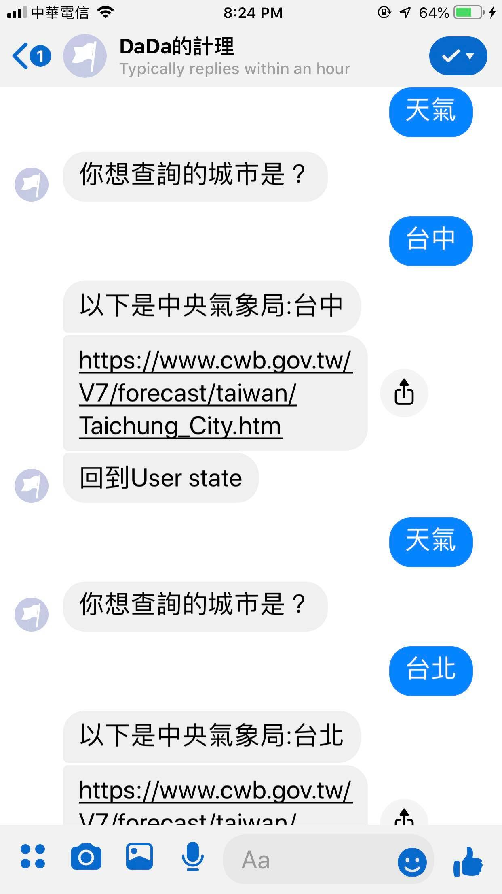

# Facebook ChatBox

Deploying a Facebook chatbox To Heroku📝

功能概述：
* 上中央氣象局網站查詢當日天氣。
* 在Dcard上選擇自己想要的板爬蟲。
* 輸入關鍵字，快速Google。

## 功能介紹：

### 查詢天氣



此功能會回傳中央氣象局當日指定地區之天氣狀況的網址。

```cmd
天氣
```
選擇要查尋天氣
```cmd
台中
```
選擇要查詢的城市

### Dcard爬蟲

<figure class="half">
 
</figure>

會前往Dcrad，選取自己想要的板，並爬取圖片。

```cmd
Dcard
```
選擇要爬取圖片

```cmd
Pet
```
選擇要爬的板

```cmd
10
```

輸入要爬多少讚以上的文（輸入非數字即視為無限制）

#### 錯誤
符合此條件的照片太少。


### Google快速搜尋


輸入關鍵字，快速查找Google前幾熱門的文章，並依照標題、網址的格式輸出。
```cmd
Google
```
選擇要Google
```cmd
台南 美食
```
選擇要搜尋的關鍵字


## 教學

### 函式介紹

#### 從指定的URL抓取Json格式
```python
import requests 
import json
url = 'https://www.dcard.tw/f/' + category
#抓取裝置名稱
headers = {'User-Agent': 'Mozilla/5.0 (Windows NT 10.0; Win64; x64) AppleWebKit/537.36 (KHTML, like Gecko) Chrome/70.0.3538.102 Safari/537.36'} 
resp = requests.get(url, headers=headers)
```

#### 解析Json格式
```python
from bs4 import BeautifulSoup 
#將JSON格式轉換為python的dict格式
soup = BeautifulSoup(resp.text,"html.parser") 
```

#### 快速解析key和value
```python
import re
#依照key從dict中找出需要的value（value只須片段符合）
sel = soup.find_all(href=re.compile("/f/" + category))
```